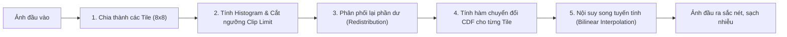

Trong xử lý ảnh số và thị giác máy tính, độ tương phản đóng vai trò quyết định đến chất lượng trích xuất đặc trưng và khả năng quan sát của con người. Một bức ảnh chụp thiếu sáng, ngược sáng hoặc có dải sáng phân bố hẹp thường khiến các chi tiết quan trọng bị chìm vào bóng tối hoặc chói lóa.

Cân bằng histogram (histogram equalization) là nhóm kỹ thuật cơ bản và hiệu quả nhằm kéo giãn dải cường độ sáng của ảnh, giúp nâng cao độ tương phản mà vẫn bảo toàn cấu trúc nội dung của ảnh. Bài viết này sẽ đi sâu vào nguyên lý hoạt động, công thức toán học và cách triển khai từ đầu ba thuật toán kinh điển: **HE (Histogram Equalization)**, **AHE (Adaptive Histogram Equalization)** và **CLAHE (Contrast Limited Adaptive Histogram Equalization)**.

---

## 1. Histogram Equalization (HE)

### Khái niệm và mục tiêu
**Histogram Equalization (HE)** là kỹ thuật cân bằng lược đồ toàn cục. Khi một bức ảnh có các giá trị điểm ảnh chỉ tập trung trong một khoảng hẹp (ví dụ toàn bộ mức xám nằm trong đoạn $[50, 100]$ thay vì trải đều $[0, 255]$), ảnh sẽ có độ tương phản rất thấp. 

Mục tiêu của HE là tìm một hàm chuyển đổi cường độ $s = T(r)$ để biến đổi phân bố mức xám ban đầu thành một phân bố xác suất đều trên toàn bộ dải giá trị $[0, L-1]$ (thông thường với ảnh 8-bit thì $L = 256$).

HE được ứng dụng rộng rãi trong xử lý ảnh vệ tinh, nâng cao chất lượng ảnh chụp X-quang, MRI và tiền xử lý cho các bài toán phân đoạn ảnh y tế.
### Nguyên lý toán học
Cho bức **ảnh xám** đầu vào có kích thước $H \times W$ với tổng số pixel $N = H \times W$, mức xám $r_k \in [0, L-1]$:

1. **Hàm mật độ xác suất (Probability Density Function - PDF):**
   $$p_r(r_k) = \frac{n_k}{N}$$
   Trong đó $n_k$ là số lượng pixel có mức xám $r_k$.

2. **Hàm phân phối tích lũy (Cumulative Distribution Function - CDF):**
   $$CDF(r_k) = \sum_{j=0}^{k} p_r(r_j) = \frac{1}{N} \sum_{j=0}^{k} n_j$$

3. **Ánh xạ mức xám mới:**
   $$s_k = T(r_k) = \text{round}\left( (L - 1) \cdot CDF(r_k) \right) = \text{round}\left( \frac{255}{H \times W} \sum_{j=0}^{k} n_j \right)$$

### Cài đặt thuật toán từ đầu với Python

```python
import cv2
import numpy as np
import matplotlib.pyplot as plt

def manual_histogram_equalization(image_gray: np.ndarray):
    """
    image_gray: Ma trận ảnh xám 2D (kích thước H x W), kiểu dữ liệu uint8 [0, 255]
    """
    h, w = image_gray.shape
    total_pixels = h * w 
    
    # 1. Tính histogram
    hist = np.zeros(256, dtype=int) 
    for row in range(h):
        for col in range(w):
            k = image_gray[row, col]
            hist[k] += 1 
            
    # 2. Tính hàm phân phối tích luỹ (CDF / SumHist)
    sum_hist = np.zeros(256, dtype=int)
    running_sum = 0 
    for k in range(256):
        running_sum += hist[k]
        sum_hist[k] = running_sum
        
    # 3. Tạo Look-Up Table (LUT) ánh xạ mức xám mới
    lut = np.zeros(256, dtype=np.uint8)
    scale_factor = 255.0 / total_pixels
    for k in range(256):
        m = round(scale_factor * sum_hist[k])
        lut[k] = np.clip(m, 0, 255) 
        
    # 4. Ánh xạ toàn bộ ảnh qua LUT
    equalized_image = np.zeros_like(image_gray)
    for row in range(h):
        for col in range(w):
            equalized_image[row, col] = lut[image_gray[row, col]]
            
    return equalized_image, hist, sum_hist
```

Trong OpenCV, ta có thể gọi trực tiếp hàm tối ưu hóa:

```python
# Đọc ảnh xám
img_gray = cv2.imread("./tire.tif", cv2.IMREAD_GRAYSCALE) 

# Cân bằng histogram toàn cục
equalized_gray = cv2.equalizeHist(img_gray)
```


### Hạn chế của HE toàn cục
Vì HE áp dụng một hàm ánh xạ duy nhất cho toàn bộ bức ảnh, nó giả định mọi vùng trong ảnh đều cần tăng cường tương đương nhau. Khi ảnh có nền quá sáng hoặc quá tối so với chủ thể, HE toàn cục sẽ làm mất chi tiết ở các vùng cục bộ hoặc làm ảnh bị cháy sáng.

---

## 2. Adaptive Histogram Equalization (AHE)
### Đặt vấn đề
Để khắc phục nhược điểm của HE toàn cục khi ảnh có độ chiếu sáng không đồng đều (vừa có vùng quá tối, vừa có vùng quá sáng), **Adaptive Histogram Equalization (AHE)** được đề xuất.

Thay vì dùng 1 biểu đồ histogram duy nhất cho toàn bộ bức ảnh, AHE chia nhỏ ảnh thành các vùng cục bộ (local neighborhoods) và tính toán hàm chuyển đổi độ tương phản độc lập cho từng điểm ảnh dựa trên vùng lân cận quanh nó.

### Cơ chế hoạt động
1. Duyệt qua từng điểm ảnh $(x, y)$ trên bức ảnh.
2. Trích xuất một cửa sổ lân cận kích thước $W \times W$ (ví dụ: $31 \times 31$ hoặc $65 \times 65$) với điểm ảnh $(x, y)$ làm tâm.
3. Tính toán histogram cục bộ $\text{hist}_{\text{local}}$ và hàm phân phối tích lũy (CDF) chỉ riêng bên trong cửa sổ $W \times W$.
4. Tính mức sáng mới cho điểm ảnh $(x, y)$ dựa trên thứ hạng của nó trong cửa sổ:

$$m(x, y) = \text{round}\left( \frac{255}{W \times W} \times \sum_{k=0}^{f(x, y)} \text{hist}_{\text{local}}[k] \right)$$

### Ưu điểm và Nhược điểm

* **Ưu điểm**: Nâng cao chi tiết cục bộ vượt trội tại các vùng bị chìm trong bóng tối hoặc bị lóa sáng mà phương pháp toàn cục không xử lý được.
* **Nhược điểm**:
  * **Khuếch đại nhiễu cực mạnh tại các vùng đồng nhất**: Tại các vùng đồng màu như bầu trời, mảng tường phẳng, da mịn, tất cả các pixel đều có giá trị gần như nhau. Histogram cục bộ sẽ tạo thành một đỉnh cực kỳ nhọn tập trung ở một dải hẹp.
  

  Khi chuẩn hóa và cân bằng, dải hẹp này bị "kéo giãn" cưỡng bức ra toàn dải $[0, 255]$, biến các dao động nhiễu ngẫu nhiên li ti thành các đốm hạt lớn rõ rệt.
  * **Chi phí tính toán rất cao**: Việc quét cửa sổ trượt $W \times W$ cho từng pixel trên toàn bộ ảnh $H \times W$ có độ phức tạp lớn.

### Cài đặt AHE với Python

```python
import cv2
import numpy as np

def manual_ahe(img_gray: np.ndarray, window_size: int = 33) -> np.ndarray:
    """
    img_gray: Ảnh xám 2D kiểu uint8 [0, 255]
    window_size: Kích thước cửa sổ lân cận W x W (phải là số lẻ, ví dụ: 15, 33, 65)
    """
    h, w = img_gray.shape
    pad = window_size // 2
    
    # 1. Thêm viền (Padding) để xử lý các pixel ở rìa ảnh
    padded_img = np.pad(img_gray, pad, mode='reflect')
    
    output = np.zeros_like(img_gray, dtype=np.uint8)
    total_pixels_in_window = window_size * window_size
    scale = 255.0 / total_pixels_in_window
    
    # 2. Duyệt qua từng pixel của bức ảnh
    for r in range(h):
        for c in range(w):
            center_val = padded_img[r + pad, c + pad]
            
            # Trích xuất cửa sổ lân cận W x W quanh pixel trung tâm
            local_window = padded_img[r : r + window_size, c : c + window_size]
            
            # Tính CDF cục bộ: Đếm số pixel <= center_val (thứ hạng rank)
            rank = np.sum(local_window <= center_val)
            
            # Ánh xạ sang mức sáng mới [0, 255]
            new_val = int(round(rank * scale))
            output[r, c] = np.clip(new_val, 0, 255)
            
    return output
```


---

## 3. Contrast Limited Adaptive Histogram Equalization (CLAHE)

**CLAHE** là phiên bản cải tiến toàn diện của AHE, được thiết kế để giải quyết triệt để vấn đề khuếch đại nhiễu và tối ưu hóa tốc độ thực thi. Thuật toán bổ sung cơ chế giới hạn độ tương phản và phân phối lại phần dư, kết hợp cùng kỹ thuật chia ô lưới và nội suy song tuyến tính.

Nhờ tính ổn định và kiểm soát nhiễu tốt, CLAHE là thuật toán khá tốt trong y tế (ảnh X-ray, CT, võng mạc) và tiền xử lý ảnh cho các mạng Deep Learning.



### Chi tiết 4 bước của thuật toán CLAHE

#### Bước 1: Chia lưới ảnh
Ảnh được chia thành các ô chữ nhật nhỏ không chồng lấn, gọi là các **tiles** với kích thước phổ biến là $8 \times 8$. Mỗi tile sẽ được tính toán biểu đồ histogram độc lập.

#### Bước 2: Giới hạn độ tương phản
Để ngăn chặn việc tạo đỉnh quá nhọn ở vùng đồng màu, thuật toán đặt ra một ngưỡng cắt trần gọi là `clipLimit`. 
- Nếu một bin histogram nào vượt ngưỡng này, phần chiều cao vượt ngưỡng sẽ bị cắt bỏ.
- Tổng số lượng pixel bị cắt không bị hủy bỏ, mà được **chia đều lại** cho tất cả các bin khác trong tile đó.
- Nhờ đó, độ dốc của hàm CDF được khống chế, triệt tiêu hoàn toàn hiện tượng khuếch đại nhiễu.
#### Bước 3: Tính toán hàm chuyển đổi (CDF Transformation)
Sau khi phân phối lại, hàm phân phối tích lũy được tính toán cho từng tile:

$$s_k = T(k) = \frac{L - 1}{N_{\text{tile}}} \sum_{j=0}^{k} h_{\text{mod}}(j)$$

Trong đó $N_{\text{tile}}$ là số điểm ảnh trong một tile và $h_{\text{mod}}$ là histogram sau khi cắt ngưỡng và phân phối lại.

#### Bước 4: Nội suy song tuyến tính (Bilinear Interpolation)
Nếu mỗi tile áp dụng trực tiếp hàm chuyển đổi của chính nó, ảnh sẽ xuất hiện đường viền ranh giới rõ rệt giữa các ô (blocking artifacts). CLAHE giải quyết vấn đề này bằng cách nội suy giá trị pixel từ hàm chuyển đổi của 4 tâm tile lân cận:

* **Điểm ở 4 góc ảnh**: Chỉ dùng hàm chuyển đổi của chính tile góc đó.
* **Điểm ở cạnh biên ảnh**: Nội suy tuyến tính 1D giữa 2 tile lân cận.
* **Điểm ở bên trong ảnh**: Nội suy song tuyến tính 2D từ tâm của 4 tile bao quanh ($T_{11}, T_{12}, T_{21}, T_{22}$).

$$I_{\text{out}}(x, y) = (1 - s)(1 - t) \cdot T_{11}(I) + s(1 - t) \cdot T_{12}(I) + (1 - s)t \cdot T_{21}(I) + st \cdot T_{22}(I)$$

*(Trong đó $s, t \in [0, 1]$ là khoảng cách chuẩn hóa từ vị trí điểm ảnh đến tâm của các ô lưới lân cận).*

---

## 4. Xử lý ảnh màu với không gian CIELAB

### Vấn đề khi áp dụng trực tiếp trên kênh RGB
Nếu áp dụng CLAHE độc lập trên 3 kênh màu đỏ, lục, lam ($R, G, B$), tỉ lệ cường độ giữa các kênh sẽ bị thay đổi đột ngột. Điều này gây ra hiện tượng **méo mó màu sắc nghiêm trọng (color shift)** và phá hủy độ bão hòa tự nhiên của bức ảnh.

### Quy trình chuẩn trong thị giác máy tính
Để giữ nguyên vẹn thông tin sắc thái màu sắc, quy tắc chuẩn là chuyển đổi sang không gian màu phân tách giữa độ sáng và sắc độ:

1. Chuyển đổi ảnh từ không gian màu **BGR/RGB** sang **CIELAB** (hoặc HSV / YCrCb).
2. Trong không gian CIELAB:
   * **Kênh $L$ (Luminance)**: Chứa toàn bộ thông tin về độ sáng và độ tương phản.
   * **Kênh $a$ và $b$ (Chrominance)**: Chứa thông tin thuần túy về màu sắc (xanh lá - đỏ, xanh dương - vàng).
3. **Chỉ áp dụng CLAHE trên duy nhất kênh $L$**, giữ nguyên vẹn kênh $a$ và $b$.
4. Gộp các kênh lại và chuyển đổi ngược về không gian RGB ban đầu.

### Mã nguồn Python minh họa

```python
import cv2
import matplotlib.pyplot as plt

def enhance_color_image_clahe(image_path: str, clip_limit: float = 2.0, tile_grid_size: tuple = (8, 8)):
    # 1. Đọc ảnh màu (BGR)
    img_bgr = cv2.imread(image_path)
    if img_bgr is None:
        raise FileNotFoundError(f"Không tìm thấy ảnh tại: {image_path}")

    # 2. Chuyển từ BGR sang không gian màu LAB
    lab = cv2.cvtColor(img_bgr, cv2.COLOR_BGR2LAB)
    l_channel, a_channel, b_channel = cv2.split(lab)

    # 3. Khởi tạo CLAHE và áp dụng lên kênh L (Luminance)
    clahe = cv2.createCLAHE(clipLimit=clip_limit, tileGridSize=tile_grid_size)
    l_enhanced = clahe.apply(l_channel)

    # 4. Gộp các kênh lại và chuyển ngược về BGR / RGB
    lab_enhanced = cv2.merge((l_enhanced, a_channel, b_channel))
    img_clahe_bgr = cv2.cvtColor(lab_enhanced, cv2.COLOR_LAB2BGR)

    # Chuyển sang RGB để hiển thị đúng màu trên Matplotlib
    img_orig_rgb = cv2.cvtColor(img_bgr, cv2.COLOR_BGR2RGB)
    img_clahe_rgb = cv2.cvtColor(img_clahe_bgr, cv2.COLOR_BGR2RGB)

    return img_orig_rgb, img_clahe_rgb
```


---

## 5. Tổng kết và so sánh các phương pháp

| Tiêu chí                   | HE                             | AHE                       | CLAHE                                          |
| :------------------------- | :----------------------------- | :------------------------ | :--------------------------------------------- |
| **Phạm vi xử lý**          | Toàn cục                       | Cục bộ qua Sliding Window | Cục bộ qua Tile Grid + Nội suy song tuyến tính |
| **Khả năng tăng chi tiết** | Kém ở các vùng sáng/tối cục bộ | Rất cao                   | Rất cao                                        |
| **Kiểm soát nhiễu**        | Trung bình                     | Kém                       | Rất tốt                                        |
| **Tốc độ tính toán**       | Rất nhanh                      | Rất chậm                  | Rất nhanh                                      |
| **Ứng dụng tiêu biểu**     | Ảnh vệ tinh, tiền xử lý nhanh  | Thử nghiệm lý thuyết      | Ảnh y tế, tiền xử lý Deep Learning, Camera ISP |
